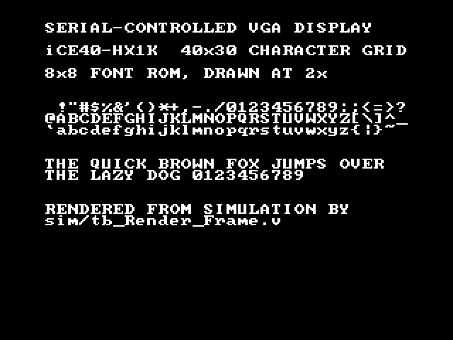

# serial-vga-display

UART-controlled VGA character display on a Lattice iCE40 FPGA, written in Verilog.

A host PC sends bytes over a serial port; the FPGA parses them and renders text
to a VGA monitor as a 40x30 grid of characters, each cell an ASCII code drawn
through a font ROM. Target board is the Nandland Go Board (iCE40-HX1K, VQ100,
25 MHz), built with the open-source toolchain: Yosys, nextpnr-ice40, IceStorm
(`icepack`, `icetime`, `iceprog`), and Icarus Verilog for simulation.

*640x480 output, rendered from simulation by
[sim/tb_Render_Frame.v](sim/tb_Render_Frame.v).*

**Status: working end to end.** Typing in a terminal puts characters on the
monitor. Every module has a self-checking testbench, and an end-to-end one
drives real serial bytes into the whole design and compares the frame it paints
against the image those bytes should produce. 

Malformed input has been run
against the board (unprintable bytes, truncated and stacked escape sequences, 
out-of-range coordinates, overflow past the last cell, and a deliberate baud 
mismatch), and none of it needed a power cycle or left the display frozen. The 
design uses 585 of 1280 logic cells and 6 of 16 block RAMs, and closes timing at 107 MHz against a 25 MHz requirement.

Still to come: a demo video and a final pass over the docs.

## Docs

- [docs/design.md](docs/design.md): the parser's state table, the byte-alignment
  invariant, the five protocol decisions and the reasoning behind each, and why
  the cell address is a running counter rather than a multiply.
- [docs/verification.md](docs/verification.md): how each module is tested, what
  the tests cover, waveform captures, the malformed-input cases run on hardware, and what is deliberately
  not covered.

## Build

    make TOP=Serial_Display_Top          # synthesize, place and route, pack
    make TOP=Serial_Display_Top prog     # flash the board over USB
    make TOP=Serial_Display_Top timing   # icetime timing report
    make font                            # regenerate rtl/Font_ROM.v
    make clean                           # remove build/

`Serial_Display_Top` is the real design. `TOP` also takes the three bring-up
designs (`UART_Loopback_Top`, still the Makefile default,
`VGA_Test_Patterns_Top` and `Static_Display_Top`) and each one names its own
file list in the Makefile. Nothing is globbed; yosys only sees the files it is
handed, so every module a design instantiates has to be listed there.

Generated files all land in `build/`, which is gitignored.

`rtl/Font_ROM.v` is the exception: it is generated by
[tools/gen_font_rom.py](tools/gen_font_rom.py) but committed, so a fresh clone
builds without Python installed.

## Simulate

    make sim TB=tb_Command_Parser       # compile with iverilog, run under vvp
    make wave TB=tb_Command_Parser      # same, then open the VCD

`sim` runs `vvp` from inside `build/`, so the relative `$dumpfile` in each
testbench puts `dump.vcd` there rather than in the source tree. `wave` opens it
with `code` for WaveTrace; override with `WAVE=gtkwave`.

`tb_Command_Parser` is self-checking and prints `PASS` or `FAIL`, along with the
simulation time each test starts at, so the log doubles as an index into
`dump.vcd`. To open the waves with its signals already chosen and grouped:

    gtkwave build/dump.vcd sim/tb_Command_Parser.gtkw

`tb_Font_ROM` and `tb_Char_Generator` print rather than plot: the first renders
each glyph it reads as ASCII art, the second captures a whole frame and compares
every pixel against the image those characters should produce.

`tb_Serial_Display_Top` runs the whole design: real serial bytes in through
`UART_TX`, pixels out, frame compared against what the protocol says should be
on screen. The grid, the frame and the UART divisor are all shrunk so a run
takes seconds.

`tb_Render_Frame` asserts nothing, instead running the same capture at the real 640x480 geometry and writing `build/frame.pgm`, so the figures in this repo are generated by the design rather than photographed:

    make sim TB=tb_Render_Frame
    ffmpeg -y -i build/frame.pgm docs/images/render.png

## Layout

    Makefile                 build and simulation targets, variables inline
    constraints/             Go Board pin constraints, provided by Nandland
    common/                  reusable modules, copied verbatim from go-board-fpga
    bringup/                 designs that prove one layer at a time
    rtl/                     new RTL for this project
    sim/                     testbenches and saved waveform signal sets
    tools/                   the font ROM generator, the font it reads, and the sender
    docs/                    design rationale and verification record
    build/                   generated, gitignored

`bringup/` holds the UART loopback and VGA test-pattern designs from the
tutorial series, plus `Static_Display_Top`, which drives the render path with a
stand-in for the character memory and no protocol in the loop. They are here so
a build or programming failure can be told apart from a bug in new RTL, and they
come out once the real design is running on hardware.

## Serial

Connect at 115200 baud, 8N1. [tools/send.py](tools/send.py) is the easiest way
in -- standard library only, so it runs on a fresh clone with no `pip install`:

    tools/send.py                        # the built-in demo screen
    tools/send.py --text 'HELLO'         # send a string
    tools/send.py --file notes.txt       # send a file
    echo HELLO | tools/send.py           # or pipe it
    tools/send.py --clear                # clear and stop
    tools/send.py --at 10 5 --text 'X'   # position the cursor first

It exists because `cat notes.txt > /dev/cu.usbserial-*` does not work: the
protocol needs CR LF where a Unix file has bare LF, and opening a tty resets the
baud rate a separate `stty` just set. `send.py` translates the newlines and
holds one descriptor across both steps.

[tools/test-page.txt](tools/test-page.txt) is a full 30-line screen built to
make a dropped byte visible. Every line ends with a bar in column 38, so a lost
or gained character moves that line's bar out of a column the eye already reads
as straight:

    tools/send.py --file tools/test-page.txt

To type at the display directly instead:

    screen $(ls /dev/cu.usbserial-*1 | tail -1) 115200

Quit with `Ctrl-A` `K`, then `y`. Run it from Terminal.app or iTerm rather than
the VS Code integrated terminal, which swallows `Ctrl-A`.

The Go Board's FTDI chip exposes two channels: channel A is the JTAG/config
port `iceprog` uses, channel B is the UART. The glob picks channel B, whose
digits come from the USB location ID and change whenever the board is plugged
into a different port.

## Scope

The design, protocol, and RTL are my own. The modules in `common/`, the designs
in `bringup/`, and the Go Board pin constraints all come from Russell Merrick's
[Nandland](https://nandland.com/project-1-your-first-go-board-project/) (the Go
Board tutorial series and *Getting Started with FPGAs*), carried over from
[go-board-fpga](https://github.com/ethanwen/go-board-fpga).

The glyph data in `rtl/Font_ROM.v` comes from
[font8x8](https://github.com/dhepper/font8x8) by Daniel Hepper (public domain),
itself based on Marcel Sondaar's public-domain IBM VGA fonts. The header is
vendored unmodified at `tools/font8x8_basic.h`; the generator that turns it into
Verilog, and the ROM module wrapped around the result, are mine.

## License

MIT. See [LICENSE](LICENSE).
