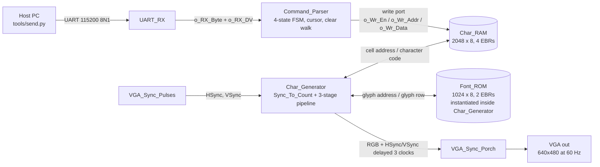

# Design

## How the pieces connect



Five modules on one 25 MHz clock, wired up in
[rtl/Serial_Display_Top.v](../rtl/Serial_Display_Top.v). Two labels on that
diagram are the design rather than the wiring:

- **The write port into `Char_RAM`** (`o_Wr_En`, `o_Wr_Addr`, `o_Wr_Data`) is
  the seam bring-up hinged on:
  [bringup/Test_Writer.v](../bringup/Test_Writer.v) drove those three signals
  before `Command_Parser` existed, proving the render path on hardware before a
  byte of protocol was written. Integration deleted the stand-in and changed
  nothing else.
- **The syncs are delayed three clocks** crossing `Char_Generator`, because the
  two chained memory reads behind each pixel cost a clock each and the syncs
  have to describe the same pixel as the video beside them. The error is
  invisible on a monitor, so it gets a testbench of its own
  ([verification.md](verification.md#the-property-that-needs-a-testbench)).

## Command parser state table

The FSM in [rtl/Command_Parser.v](../rtl/Command_Parser.v) has four states and
six classes of input byte. Every cell below says two things: the next state, and
what happens to the cursor and to the write port.

### Input classes

| Class | Bytes | Meaning |
| --- | --- | --- |
| Printable | `0x20`–`0x7E` | character to display |
| Line Feed (LF) | `0x0A` (`\n`) | next row |
| Carriage Return (CR) | `0x0D` (`\r`) | start of row |
| Form Feed (FF) | `0x0C` | clear |
| Escape (ESC) | `0x1B` | position |
| Other | everything else | no meaning |

`∅` means unchanged — no write, no cursor movement.

### IDLE

The only state whose behavior depends on which byte arrived.

| | Printable | LF | CR | FF | ESC | Other |
| --- | --- | --- | --- | --- | --- | --- |
| **Next state** | `IDLE` | `IDLE` | `IDLE` | `CLEAR` | `ESC_COL` | `IDLE` |
| **Cursor** | advance 1, wrap to (0,0) | row + 1, col ∅; `addr += c_COL` | row ∅, col 0; `addr -= r_COL` | reset clear counter, `o_Busy = 1` | ∅ | ∅ |
| **Write** | `o_Wr_En = 1`, `addr = cursor`, `data = i_RX_Byte` | N/A | N/A | N/A this cycle | N/A | N/A |

### ESC_COL, ESC_ROW, CLEAR

In these three states the input class doesn't matter; every byte is a
coordinate, or ignored outright.

| State | Next state | Cursor | Write |
| --- | --- | --- | --- |
| `ESC_COL` | `ESC_ROW` | ∅ | N/A; `r_ESC_COL <= i_RX_Byte` |
| `ESC_ROW` | `IDLE` | `r_COL <= r_ESC_COL` (clamped to `c_COL-1`), `r_ROW <= i_RX_Byte` (clamped to `c_ROW-1`); `addr = r_ROW * c_COL + r_COL` | N/A |
| `CLEAR` | `CLEAR` while counting; `IDLE` in the final cycle | ∅; (0,0) on exit | `o_Wr_En = 1`, `addr = counter`, `data = 0x20`; input ignored |

## The byte-alignment invariant

**The escape states consume exactly two bytes, whatever those bytes are.** Once
`ESC` moves the FSM out of `IDLE`, the next byte is a column and the one after it
is a row — no byte is ever re-examined, rejected, or pushed back. Every path
through `ESC_COL` and `ESC_ROW` is the same length.

This is what makes the rest of the parser easy to reason about. Validity is
handled by clamping the value, never by refusing the byte, so there is no path
where a malformed sequence consumes one byte instead of two and leaves the parser
reading the host's next character as a coordinate forever after. Byte alignment
is a property of the state machine's shape, not of the data flowing through it.

The invariant under test, with `ESC` followed by two printable bytes:
[verification.md](verification.md#waveforms).

## The protocol decisions

Each of these is a fork with no universally right answer; instead, I have chosen a design implementation, with my thoughts behind it:

### Out-of-range coordinates: clamp

`ESC 200 200` on a 40×30 grid sets the cursor to (39, 29) rather than being
ignored.

Clamping preserves an invariant the whole design leans on: **the cursor is always
a real cell**. Nothing downstream ever needs a range check or a defined behavior for an out-of-bounds address, because an out-of-bounds cursor cannot exist. Ignoring the
sequence instead would push that burden outward: some other module would have to
decide what a cursor pointing off-screen means. The cost, however, is that a host bug producing garbage coordinates is silently absorbed instead of being made visible.

Tested by `ESC 200 200` on the 4×3 simulation grid, which clamps to (3, 2) —
see [verification.md](verification.md#coverage).

### End of screen: wrap

Advancing past the last cell returns the cursor to (0,0) rather than sticking at
the last cell or stopping.

Same invariant, extended in time: the cursor stays a real position no matter how
many characters arrive. The practical version of the argument is `cat`ting a long
file at the display. With wrap, the screen keeps painting, even if what you're reading scrolls past. With a sticky cursor, output
piles into one cell and the system looks hung, which is indistinguishable from an
actual hang at the moment you most want to tell them apart.

Wrapping to (0,0) rather than scrolling is the cheap choice: scrolling means
moving 1200 cells of RAM per line, and there is no budget for that.

### A byte arriving during `CLEAR`: drop it

Bytes received while `o_Busy` is high are discarded, not queued.

The timing says this never happens. At 115200 baud and 25 MHz a byte occupies
217 × 10 = 2170 clocks, and the clear walk is `c_COL * c_ROW` = 1200 clocks — the
walk finishes with 970 clocks to spare before the next byte can complete. The
margin is 1.8×, and it comes from the two datasheet numbers rather than from
measurement.

So the decision is really about what to do in a case the timing analysis says is
unreachable. Dropping is one line and cannot fail. Queueing means a holding
register, plus an answer for what happens to the *second* byte, plus a way to
test a path that normal operation never enters. `o_Busy` exists to make the claim
checkable, not because anything is expected to act on it.

### `ESC` inside an escape sequence: it's column 27

`ESC 0x1B ...` sets the column to 27. `ESC` is not special once the FSM has left
`IDLE`.

The alternative is treating `ESC` as a restart — abandon the partial sequence and
begin a new one. That is friendlier to a host that changes its mind mid-sequence,
but it breaks the invariant above: a sequence would then consume two bytes
normally and one byte on restart, and the parser would need a resync rule. One
uniform rule ("in the escape states, every byte is a coordinate") is smaller in
hardware and shorter to state than any rule with an exception in it.

**The limitation being accepted:** there is no way to abort a partial escape
sequence, and no timeout on one. If the host sends `0x1B` and then dies, the
parser waits in `ESC_COL` indefinitely, and the next byte to arrive — a minute
later, from an unrelated write — is eaten as a column. Host and parser can
desynchronize, and nothing recovers them automatically.

This is bounded, which is why it's acceptable: at most two bytes are ever
misread, the FSM always returns to `IDLE`, and the display keeps refreshing
throughout, so the system does not lock up under any input.

### Power-up: no clear, and none needed

The parser starts in `IDLE`, and nothing blanks the screen at configuration. The
display comes up empty anyway, because of two facts that are each checkable
rather than assumed:

- **The bitstream loads `Char_RAM` with zeros.** All six block RAMs get explicit
  `.ram_data` sections in `build/Serial_Display_Top.asc` — two carrying font
  glyphs, and `Char_RAM`'s four written as all zeros. The memory is configured,
  not merely undefined.
- **Font entry `0x00` is blank.** font8x8 leaves all 32 control-character glyphs
  empty, confirmed when the ROM was generated.

Starting the FSM in `CLEAR` instead was considered and rejected; it buys nothing visible, since `0x00` and `0x20` render identically, and its only real argument is that every cell would then definitely hold the byte the protocol calls empty. However, this is not the case, as
the walk would begin on clock one, inside the
post-configuration window where block RAM writes are dropped
([verification.md](verification.md)), so the first ~50 cells would keep `0x00`
while the rest became `0x20`. Making it correct means a startup hold inside the
shipping parser — real complexity, added to the design rather than to
scaffolding, to fix something with no symptom.

Nothing reads `Char_RAM` except `Char_Generator`, and it maps `0x00` and `0x20`
to the same blank cell. The mismatch between what the memory holds and what the
protocol calls empty is therefore unobservable, and `FF` exists for a clear the
user actually asked for.

## Address arithmetic

The cell address is `r_ROW * c_COL + r_COL`. Written that way it is also built
that way: the iCE40-HX1K has no hard multipliers, so yosys would build one out of
LUTs, and there are only 1280 LUTs in the whole part.

**A running address register is the primary representation.** `o_Wr_Addr` is a
counter, and each cursor motion is an increment or a constant offset:

| Motion | Address update |
| --- | --- |
| printable character | `r_Addr <= r_Addr + 1` |
| wrap at end of screen | `r_Addr <= 0` |
| LF | `r_Addr <= r_Addr + c_COL` |
| CR | `r_Addr <= r_Addr - r_COL` |
| `CLEAR` walk | the walk counter itself |

Every one of those is an adder. Nothing on the per-character path multiplies, and
the per-character path is the one that runs constantly.

**`ESC_ROW` is the single exception.** The escape sequence delivers a (col, row)
pair directly, so the address has to be reconstructed from it — this is the one
place the multiply is unavoidable. It costs nothing anyway, because `c_COL` is a
constant: `r_ROW * 40` is `r_ROW * 32 + r_ROW * 8`, two shifts and an add, and
yosys does that reduction without being asked. A constant multiply is not a
multiplier.

The consequence is that the address and the (col, row) pair are two
representations of the same state, and they must be kept consistent — `ESC_ROW`
writes all three registers together, and every other path updates all three in
step. That duplication is deliberate. Keeping (col, row) alongside the address is
what makes wrap and CR detectable at all: `r_COL == c_COL-1` is a comparison
against a constant, whereas recomputing "am I at the end of a row?" from the
address alone would mean a divide.

Recomputing `r_ROW * c_COL + r_COL` on every character would put that constant
multiply — small as it is — plus its adder on the critical path of the common
case, to produce a number an increment already had. The running register makes
the frequent operation free and pays for the rare one once.

## The two memories

The design holds two memories, and both had to become block RAM rather than
logic for it to fit at all.

| | Shape | Purpose |
| --- | --- | --- |
| `Char_RAM` | 2048 × 8 | one ASCII code per grid cell; parser writes, generator reads |
| `Font_ROM` | 1024 × 8 | 128 glyphs × 8 rows of an 8×8 font |

### Why `Char_RAM` is 2048 deep and not 1200

The grid is 1200 cells, but the character generator computes an address for
*every* pixel, including the ones in the blanking intervals. During vertical
blanking the cell row runs past the last live row; during horizontal blanking
the cell column runs to 49 and `row * 40 + 4x` lands on the next row's cells.
The widest address reached is **1329**. Because 1329 needs 11 address bits, we are left with 2048 words, given that 11 bits of address *is* 2048 words.

### How the block RAMs get built

An iCE40 `SB_RAM40_4K` always holds 4096 bits. Its four configurations trade
depth against width: 256×16, 512×8, 1024×4, 2048×2.

Tiling a `D × W` memory out of `d × w` blocks takes `ceil(D/d)` stacked in depth
and `ceil(W/w)` stacked in width, and the two cost differently. Width-stacking
is free (one block drives bits `[3:0]`, another `[7:4]`, and that is wires).
Depth-stacking needs a multiplexer, because both blocks see the low address bits
and the high bits have to select whose output is real, which is LUTs on the read
path.

So yosys takes the shallowest mode that still holds the whole depth in one
block, then width-stacks to reach the word size:

| | Mode chosen | Deep × wide | EBRs |
| --- | --- | --- | --- |
| `Font_ROM` (1024 × 8) | 1024×4 | 1 × 2 | 2 |
| `Char_RAM` (2048 × 8) | 2048×2 | 1 × 4 | 4 |

`Font_ROM` could equally have been two 512×8 blocks, but that is two deep and
would need the mux, so 1024×4 wins. `Char_RAM` is the same trade one rung down.
Neither ends up with a multiplexer on its read path.

Six of the part's sixteen EBRs, confirmed from the `READ_MODE` parameters on the
`SB_RAM40_4K` cells in the synthesised netlist rather than predicted:
`10` is 1024×4, `11` is 2048×2.

Measured on the shipping design, `Serial_Display_Top`:

```
ICESTORM_LC :  585/1280   45%
ICESTORM_RAM:    6/16     37%
Max frequency: 108.54 MHz     (PASS at 25.00 MHz)
```

Read off `build/Serial_Display_Top-nextpnr.log` after routing, not the
post-placement estimate printed earlier in the same log. The Makefile passes
`--freq 25` so that "PASS" is measured against the Go Board's actual clock;
without the flag nextpnr checks against its own 12 MHz default and reports a
pass against a target nothing in the design ever claimed.

The logic figure went *up* on integration, from `Static_Display_Top`'s 515, even
though `UART_TX` and the bring-up writer both came out: `Command_Parser` costs
more than either, carrying a cursor, a clear-walk counter, a four-state FSM and
the `ESC_ROW` address reconstruction. Seventy cells for a protocol is cheap.

That reconstruction is also the critical path: nextpnr traces 9.21 ns from
`UART_RX`'s byte register, through the row clamp's compare chain
([Command_Parser.v:53](../rtl/Command_Parser.v#L53)), through
`w_Row_Clamped * c_COLS + w_Col_Clamped`
([:123](../rtl/Command_Parser.v#L123)), to setup on `r_Addr`. That is
[Address arithmetic](#address-arithmetic) arriving from the other direction;
the per-character path is increments and stays shallow, so the one rare path
that has to multiply sets the ceiling. With a 4.3x margin, it can stay.

### The synchronous read is what makes any of this work

Both memories present their data one clock after the address, from a registered
read. This is not a stylistic choice, as an EBR read is registered by
construction, so an asynchronous read cannot map to one at all. The same
`Char_RAM` module, with `assign o_Rd_Data = r_Mem[i_Rd_Addr];` in place of the
clocked read, synthesises to:

```
16,521  SB_LUT4
16,384  SB_DFFE
     0  SB_RAM40_4K
```

against a part with 1,280 LUTs. This is thirteen times over budget, from a one-line
difference. However, using synchronous reads adds a clock of latency per read, forcing `Char_Generator` to be a pipeline (the character RAM
read and the font ROM read are two of its three stages). In this way, memories are not
attached to the pipeline, they *are* most of it.

### No arbitration, and no clock crossing

`SB_RAM40_4K` is a genuine dual-port block, with independent address, data and
enable on each side, so the generator's every-clock reads and the parser's
occasional writes never contend. The two sides do not share the memory; the
primitive has two ports.

A write to the cell being read in the same cycle returns the old byte, from
nonblocking assignment in simulation and from the primitive in hardware. That is
one wrong character for one frame, 16 ms at 60 Hz, and no logic is spent on it.

Parser, memory and generator all run on the same 25 MHz clock, so there is no
clock domain crossing anywhere in the design; the UART is oversampled at 217
clocks per bit rather than being given a clock of its own.
