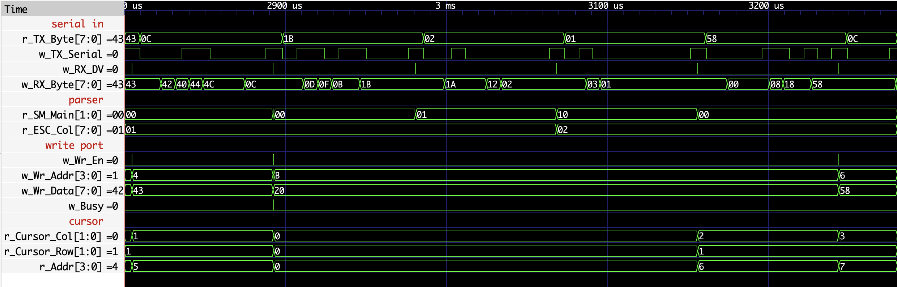
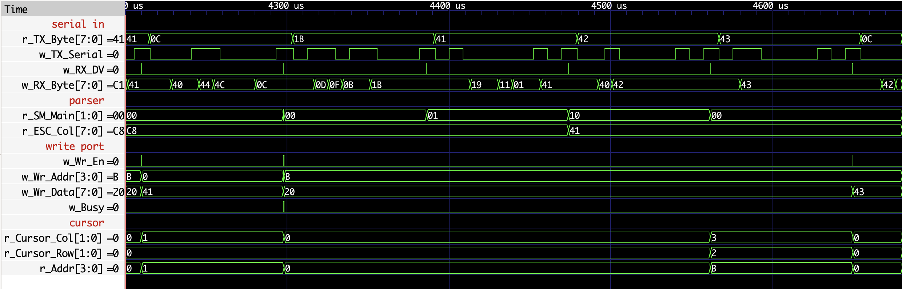

# Verification

This document records the tests done for the modules and files written, ensuring that implementation matches [design.md](design.md). 

## Command_Parser

```
make sim TB=tb_Command_Parser              # prints PASS or FAIL
make wave TB=tb_Command_Parser WAVE=gtkwave
gtkwave build/dump.vcd sim/tb_Command_Parser.gtkw   # with the saved signal set
```

### The harness

[sim/tb_Command_Parser.v](../sim/tb_Command_Parser.v) instantiates `UART_TX`
feeding `UART_RX` feeding the parser, so every test drives the real receive path
rather than a model of it. The grid is shrunk to 4×3 (12 cells) so that a wrap
happens after four characters and a clear walk is twelve cycles, which can be easily counted.

Checks run against a **scoreboard**: a testbench-side array mirroring every write
the parser issues, so tests assert on the resulting screen contents rather than
on cycle-by-cycle behavior. Changing the parser's internal timing does not break
the tests; changing its behavior does.

Two counters back that up. `r_Writes` catches a write-enable that plateaus
instead of pulsing; a character that writes once is asserted as *exactly* one
write. `r_Busy_Cycles` asserts the clear walk is exactly `c_COLS * c_ROWS` cycles
long.

### Coverage

| # | Test | What it proves |
| --- | --- | --- |
| 1 | One character | Lands at cell 0; exactly one write pulse |
| 2 | Short string | Consecutive cells, cursor advances |
| 3 | Fifth character | Column wrap onto the next row |
| 4 | `FF` | All cells blank, `o_Busy` high exactly 12 cycles, cursor *and* column counter reset |
| 5 | `LF` | Row advances, column preserved |
| 5b | `LF` on the last row | Wraps to row 0, keeps the column |
| 6 | `CR` | Column 0, same row, earlier cells untouched |
| 7 | `CR LF` | The sequence a real host sends |
| 8 | `ESC 2 1` | Cursor positioning; the sequence itself writes nothing |
| 9 | `ESC 200 200` | Clamps to the last cell; writing there wraps to the origin |
| 10 | `0x00`, `0x7F`, `0x80` | Ignored; the cursor does not move |
| 11 | `ESC "A" "B"` | Printables after `ESC` are coordinates, not characters |
| 12 | Byte during `CLEAR` | Dropped; the parser still works afterwards |

Tests 9, 10, 11 and 12 all test malformed inputs, cases a host bug or a dropped
byte would produce.

### Testing a case the hardware cannot reach

Test 12 needs a byte to arrive *inside* the clear walk. The serial path cannot
stage that: a byte occupies 2170 clocks and the walk is 12, which is exactly the
timing margin argued in [design.md](design.md#a-byte-arriving-during-clear-drop-it).
The condition the FSM defines is, by construction, one the wire cannot deliver.

As such, the parser's `i_RX_DV` is muxed in the testbench, and `INJECT_BYTE` presents a
byte with a one-clock pulse exactly as `UART_RX` would. The tradeoff is explicit:
injected bytes exercise the parser's contract, not the receive path. That is
acceptable only because the other 12 tests all run through the real
`UART_TX` → `UART_RX` chain.

### Waveforms



`ESC 02 01` on the 4×3 test grid. The FSM steps `IDLE → ESC_COL → ESC_ROW →
IDLE`, `r_ESC_Col` latches the column byte between the two, and `o_Wr_En` stays
low for all three bytes of the sequence. The next printable byte, `58` (`"X"`),
writes at address 6 = row 1 × 4 + column 2.



`ESC "A" "B"`, the two printable bytes are consumed as coordinates, not
displayed: `o_Wr_En` never rises while they arrive. 65 and 66 clamp to the last
column and row, so the cursor lands at (3, 2) and `r_Addr` at 11. `"C"` then
writes there, wrapping the cursor back to (0, 0).

Noting that:
- `r_ESC_Col` shows `C8` on entry, using a value from the previous test still in the register until the new sequence overwrites it.
- `w_Wr_Addr` does not transition at the `"C"` write, because the clear walk's last cell was also address 11.

In both cases, `r_Addr` going
`B → 0` and `w_Wr_Data → 43` under the `o_Wr_En` pulse are what show the write
landing, not the address trace.

In both shots `w_RX_Byte` churns through intermediate values between bytes, showing `UART_RX` shifting bits into `r_RX_Byte` in place; only its value at the
`o_RX_DV` pulse is meaningful. `r_TX_Byte`, on the top row, shows the byte
actually being sent.

### Trusting the tests

A testbench that passes the first time it runs has not yet demonstrated it can
fail. Each of these bugs was introduced into a scratch copy of the parser, and
each was caught:

| Mutation | |
| --- | --- |
| ESC coordinates not clamped | caught |
| `o_Wr_En` default assignment removed, so writes plateau | caught |
| Clear walk stops one cell short | caught |
| Clear resets the address but not the column counter | caught |
| `CR` resets the column but not the address | caught |
| `LF` does not wrap from the last row | caught |
| `ESC_ROW` rebuilds the address from the pre-update cursor | caught |
| No wrap past the last cell of the screen | caught |
| `CLEAR` acts on a byte instead of ignoring it | caught |

**This found a real hole.** On the first pass the `LF`-no-row-wrap mutation
*passed*, because no test ever sent `LF` from the bottom row, and as such test 5b 
was appended to the testing suite.

It also showed why the redundant-state warning in
[design.md](design.md#address-arithmetic) matters. Deleting the column reset from
`CLEAR` did not fail at the obvious check: the address still reset correctly, so
the next character still landed at cell 0. The stale column only surfaced three
tests later as a wrap firing one cell early. Test 4 now forces a wrap immediately
after the clear, so that inconsistency fails at its cause rather than somewhere
unrelated.

### Not covered

- The parser has no reset input; registers rely on initialization at
  configuration, which is normal for iCE40 but means power-on behavior is
  untested by simulation.
- Only the 4×3 grid is simulated. The 40×30 parameterization is exercised by
  synthesis, not by any test.
- No test drives two bytes closer together than the UART allows, other than the
  injected pair in test 12.

## Bring-up designs

`UART_Loopback_Top` and `VGA_Test_Patterns_Top` were confirmed on real hardware
(Go Board, iCE40-HX1K): characters echo back over the serial port with their hex
on the seven-segment displays, and the pattern designs sync on a monitor with the
pattern selected by the low nibble of a received byte. Their testbenches,
[tb_UART_Loopback.v](../sim/tb_UART_Loopback.v) and
[tb_VGA_Test_Patterns.v](../sim/tb_VGA_Test_Patterns.v), came with the book
projects and are not self-checking.
